# Crypto Arbitrage Calculations

### This is a cryptocurrency arbitrage analysis of bitcoin's historical data from January - March 2018 on two different platforms: Bitstamp and Coinbase. Analysis and alculations were made after preparing and cleaning the data.

---

## Technologies

This project leverages python 3.7 and Jupyter lab notebook was used to run all analysis.

---

## Installation Guide

Before running the application first import the following libraries and dependencies.

```python
  import pandas as pd
  from pathlib import Path
  %matplotlib inline
```

---

## Collect the data

Using the Pandas `read_csv` function and the `Path` module, both Bitstamp and Coinbase databases were imported and then created into dataframes. The DatetimeIndex was set as teh Timestamp column and the dates were parsed and formatted:

```python
bitstamp_df = pd.read_csv(
    Path('./Resources/bitstamp.csv'),
    index_col="Timestamp",
    parse_dates=True,
    infer_datetime_format=True
)
```

---

## Preparing the data

For both databases, `NaN` or missing values were all replaced or droped . Then, the `str.replace` function was used to remove the dollar signs ($) from the values in the columns. The data type of the Close column was converted to a `float`. Finally, `duplicated().sum()` was used to make sure there were no duplicates in each datafram.

Main functions used were the following:

\*`loc` : to identify the Close column

\*`dropna()` : to remove all missing values

\*`float` : to convert data to float

\*`duplicated.().sum()` : to double check if there are any duplicates; sum should be **zero**.

---

## Data Analysis

To best analyze the trading profits on each platform, the closing price, indicated in the Close cloumn of each dataframe, is what the analysis focused on.
To do so, a new dataframe was created for Bitstamp (bitstamp_sliced) and Coinbase (coinbase_sliced), which contains the Timestamp index and the Close column.

Both dataframes were then overlayed to create a visualization of patterns:

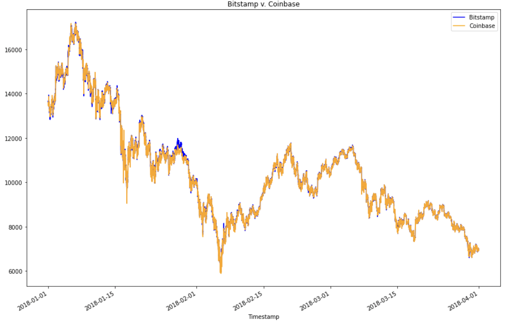

However, to better visualize the data, an overlay plot of January 2018 and March 2018 were created in an attempt to find any drastic spread changes over time. Unfortunately, there were no big changes over these two months in 2018.

Next, three separate dates were chosen to look at the early, middle, and late trading days to evaluate for arbitrage profitability. Line and box plots were graphed to best visualize the data for January 16, February 24, and March 26.

**January 16, 2018 line plot**

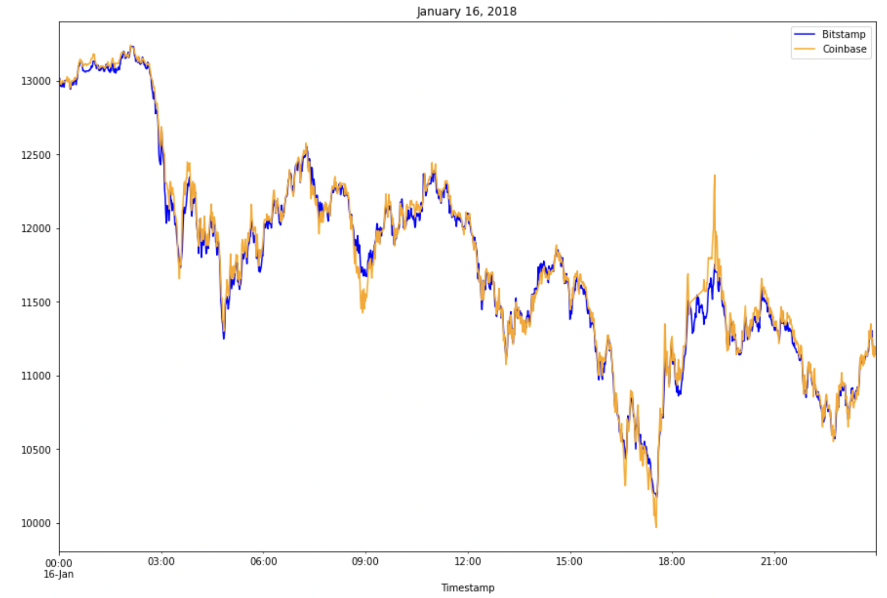

**January 16, 2018 box plot**

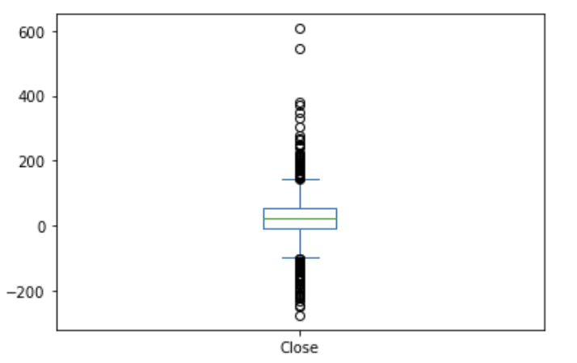

**January 16, 2018 data summary**

```python
count    1419.000000
mean       23.212135
std        67.789186
min      -275.920000
25%        -8.330000
50%        22.280000
75%        52.355000
max       606.800000
Name: Close, dtype: float64
```

According to the summary, there were 1419 data points where the average difference between the two prices is $23.21. The maximum difference was $606.80 and the minimum difference was -$275.92, which means that a time existed when Bitstamp had a higher price than Coinbase.

**February 24, 2018 line plot**

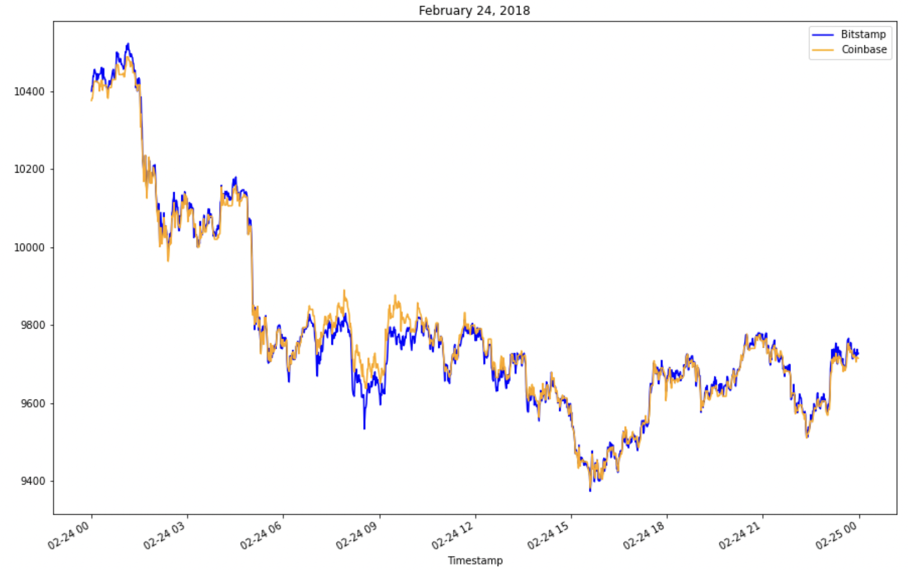

**February 24, 2018 box plot**

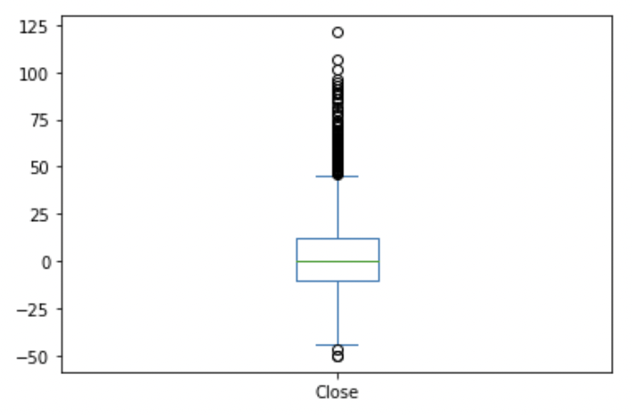

**February 24, 2018 data summary**

```python
count    1437.000000
mean        3.396131
std        22.969472
min       -50.180000
25%       -10.590000
50%        -0.010000
75%        12.120000
max       121.320000
Name: Close, dtype: float64
```

According to the summary, there were 1437 data points where the average difference between the two prices is $3.40. The maximum difference was $121.32 and the minimum difference was -$50.18, which means that a time existed when Bitstamp had a higher price than Coinbase.

**March 26, 2018 line plot**

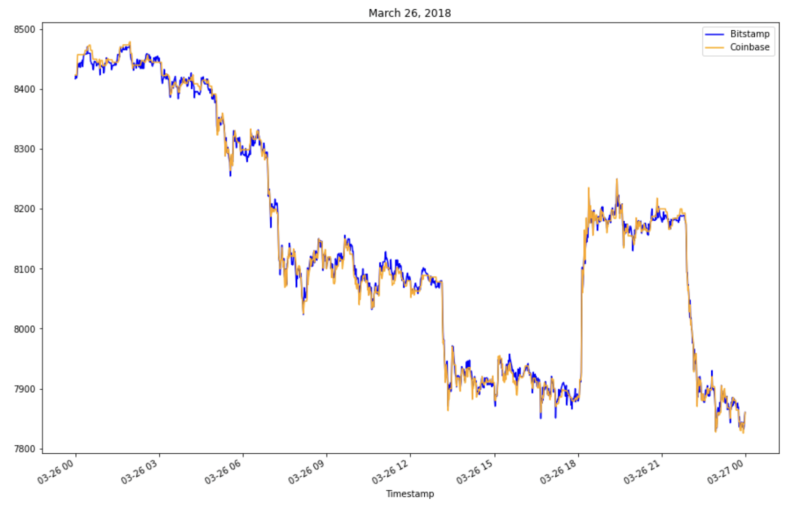

**March 26, 2018 box plot**

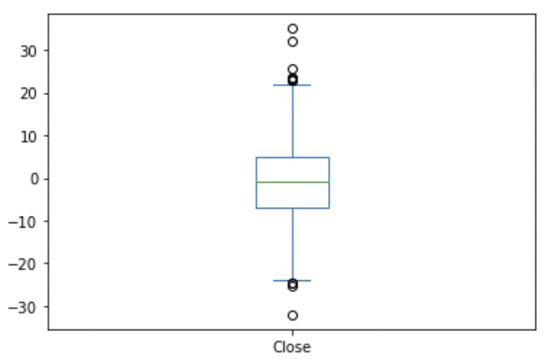

**March 26, 2018 data summary**

```python
count    1432.000000
mean       -0.722193
std         8.523060
min       -32.040000
25%        -6.812500
50%        -0.730000
75%         4.965000
max        35.070000
Name: Close, dtype: float64
```

According to the summary, there were 1432 data points where the average difference between the two prices is -$0.72. The maximum difference was $35.07 and the minimum difference was -$32.04, which means that a time existed when Bitstamp had a higher price than Coinbase.

---

## Arbitrage Profit Calculations

For each of the three dates, the following calculations were made:

- The arbitrage spread between the two exchanges were measured by subtracting the lower-priced exchange (Bitstamp) from the higher-priced one (Coinbase). Calculations were carried out for Jan. 16th, Feb. 24th, and Mar. 26th as well:

**Jan 16, 2018**

```python
arbitrage_spread_early = coinbase_sliced.loc['2018-01-16'] - bitstamp_sliced.loc['2018-01-16']
arbitrage_spread_early[arbitrage_spread_early>0].describe()

count    960.000000
mean      53.405344
std       53.910409
min        0.010000
25%       21.602500
50%       39.885000
75%       68.547500
max      606.800000
Name: Close, dtype: float64
```

**Feb 24, 2018**

```python
arbitrage_spread_middle = coinbase_sliced.loc['2018-02-24'] - bitstamp_sliced.loc['2018-02-24']
arbitrage_spread_middle[arbitrage_spread_middle>0].describe()

count    713.000000
mean      19.880351
std       20.699851
min        0.010000
25%        5.040000
50%       12.330000
75%       27.250000
max      121.320000
Name: Close, dtype: float64
```

**Mar 26, 2018**

```python
arbitrage_spread_late = coinbase_sliced.loc['2018-03-26'] - bitstamp_sliced.loc['2018-03-26']
arbitrage_spread_late[arbitrage_spread_late>0].describe()

count    651.000000
mean       6.689247
std        5.240159
min        0.010000
25%        2.835000
50%        5.230000
75%        9.195000
max       35.070000
Name: Close, dtype: float64
```

- The spread returns were also calculated for each date.

**Jan 16, 2018**

```python
spread_return_early= arbitrage_spread_early[arbitrage_spread_early>0] / bitstamp_sliced.loc['2018-01-16']
spread_return_early[arbitrage_spread_early>0]

Timestamp
2018-01-16 00:02:00    0.000731
2018-01-16 00:03:00    0.001108
2018-01-16 00:04:00    0.000909
2018-01-16 00:05:00    0.002485
2018-01-16 00:06:00    0.001665
                         ...
2018-01-16 23:47:00    0.005847
2018-01-16 23:49:00    0.000921
2018-01-16 23:50:00    0.004076
2018-01-16 23:55:00    0.000546
2018-01-16 23:57:00    0.002153
Name: Close, Length: 960, dtype: float64
```

**Feb 24, 2018**

```python

spread_return_middle= arbitrage_spread_middle[arbitrage_spread_middle>0] / bitstamp_sliced.loc['2018-02-24']
spread_return_middle[arbitrage_spread_middle>0]

Timestamp
2018-02-24 00:10:00    0.000123
2018-02-24 00:27:00    0.000189
2018-02-24 00:28:00    0.000487
2018-02-24 01:23:00    0.000574
2018-02-24 01:24:00    0.000163
                         ...
2018-02-24 23:20:00    0.000253
2018-02-24 23:47:00    0.000179
2018-02-24 23:48:00    0.000846
2018-02-24 23:49:00    0.000663
2018-02-24 23:51:00    0.000178
Name: Close, Length: 713, dtype: float64
```

**Mar 26, 2018**

```python
spread_return_late= arbitrage_spread_late[arbitrage_spread_late>0] / bitstamp_sliced.loc['2018-03-26']
spread_return_late[arbitrage_spread_late>0]

Timestamp
2018-03-26 00:00:00    0.000738
2018-03-26 00:01:00    0.000122
2018-03-26 00:02:00    0.000470
2018-03-26 00:03:00    0.000576
2018-03-26 00:04:00    0.001395
                         ...
2018-03-26 23:46:00    0.001146
2018-03-26 23:53:00    0.000819
2018-03-26 23:54:00    0.000879
2018-03-26 23:56:00    0.001148
2018-03-26 23:57:00    0.000587
Name: Close, Length: 651, dtype: float64
```

- Summary statistics of the spread returns greater than 1% were also generated for each date.

**Jan 16, 2018**

```python
profitable_trades_early= spread_return_early[spread_return_early>0.01]
profitable_trades_early.head()
profitable_trades_early.describe()

# These are the profitable trades
2018-01-16 02:56:00    0.012962
2018-01-16 02:57:00    0.010838
2018-01-16 02:59:00    0.014171
2018-01-16 03:00:00    0.010675
2018-01-16 03:06:00    0.019704
Name: Close, dtype: float64
```

**Feb 24, 2018**

```python
profitable_trades_middle= spread_return_middle[spread_return_middle>0.01]
profitable_trades_middle.head()

# These are the profitable trades
Timestamp
2018-02-24 08:32:00    0.012726
2018-02-24 09:32:00    0.010974
2018-02-24 09:39:00    0.010431
Name: Close, dtype: float64
```

However, there were no positive returns greater than 1% generated for March 26th.

- For January 16th and February 24th, potential profits were calculated by multiplying the spread returns that were greater than 1% by the cost of what was purchased. All missing values were dropped from the resulting dataframe.

**January 16, 2018 potential profit per trade calculations and plot**

```python
profit_early = profitable_trades_early * bitstamp_sliced.loc['2018-01-16']
profit_early

profit_per_trade_early = profit_early.dropna()

profit_per_trade_early.describe()

count     73.000000
mean     193.796849
std       88.701429
min      112.520000
25%      139.420000
50%      171.310000
75%      210.060000
max      606.800000
Name: Close, dtype: float64
```

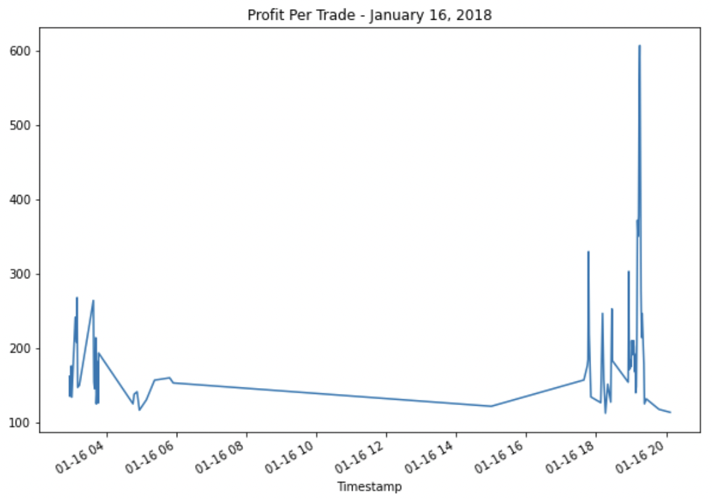

**February 24, 2018 potential profit per trade calculations and plot**

```python
profit_middle = profitable_trades_middle * bitstamp_sliced.loc['2018-02-24']
profit_middle

profit_per_trade_middle = profit_middle.dropna()
profit_per_trade_middle.describe()

count      3.000000
mean     110.023333
std       10.129246
min      101.750000
25%      104.375000
50%      107.000000
75%      114.160000
max      121.320000
Name: Close, dtype: float64
```

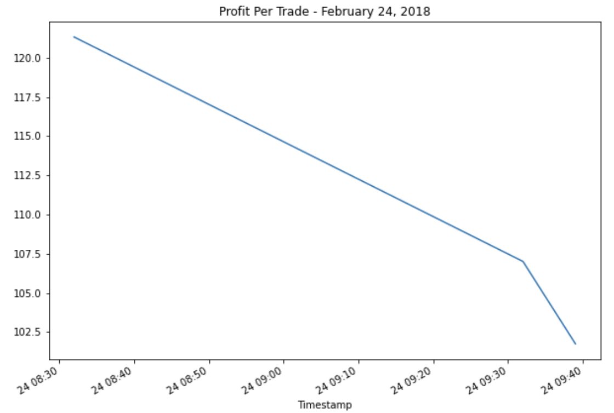

From the two profitable trade days, the `sum() ` was used to calculate the sum of the potential profits.
For January 16, the sum was $14,147.17 and for February 24, it was $330.70.

Lastly, using the `cumsum` function, the cumulative profits over time for January 16th and February 24th were generated and plotted.

**Jan 16, 2018 cumulative**

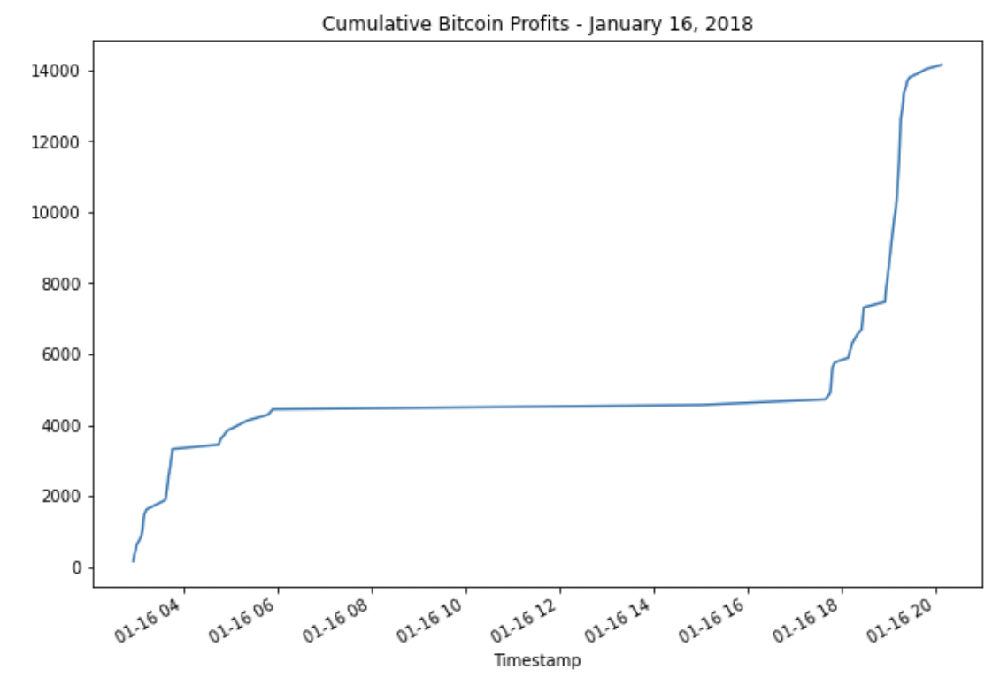

**Feb 16, 2018 cumulative**

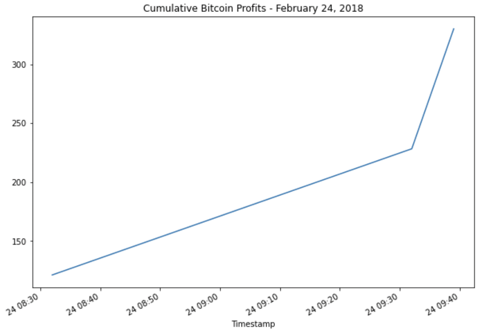

---

## Conclusion

In the three random (early, middle, and late) dates we chose in 2018, Bitcoin generated the most profitable arbitrage profits on January 16th and had the longest timeframe for profitable trades, totalling $14,147.70. February 24th was also profitable but only within the first hour of the day that generated a cumulative profit of $330.07.

March 26th was not a profitable trading day where there were no positive returns greater than 1% minimum threshold that we need to cover our costs.
